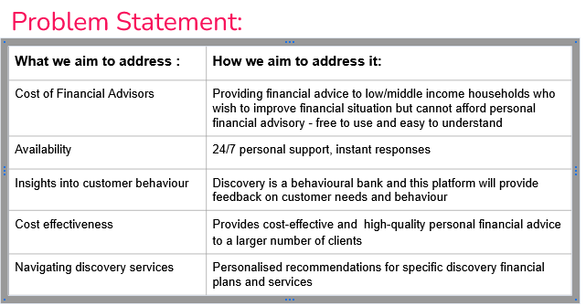
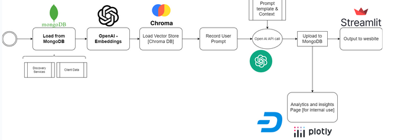

# Discovery Gradhack 2024 Silicon Slippers
# AI financial advisor 

### Overview

This was a RAG application built for Discovery Bank for the 2024 Gradhack. 
It is a AI financial advisor that offers personal financial advice 24/7.
We implemented analytics and emailing features for execs at the bank to find out more about their customers.
It uses Mongo, Chroma and Langchain as the drivers for the project.

Here is our problem statement:

This is a high level overview of the application: 

The json file should be inserted into your MongoDB for this to work and other files with this format will also work.
This is where the actual information is stored and fetched to make the ChromaDB.

